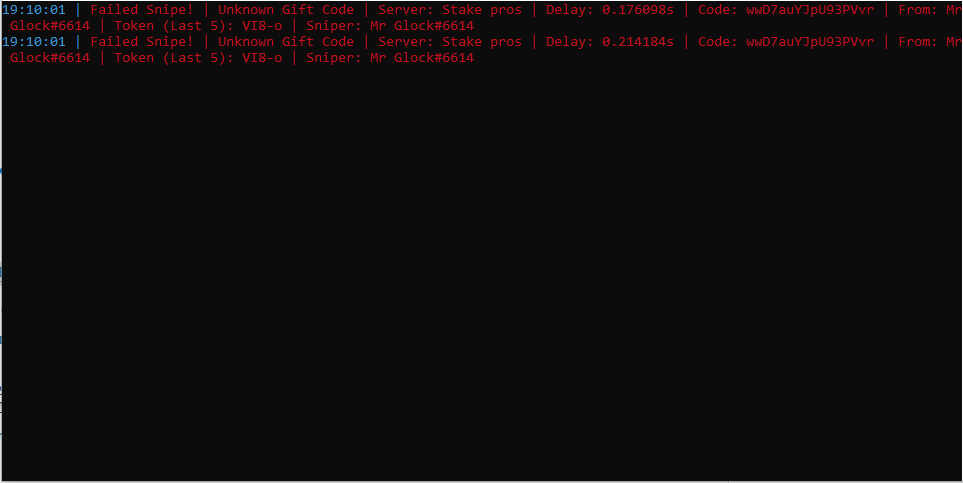

Discord Nitro sniper Written in GO lang



#### Features

* Multiple accounts support to claim on one main account
* Set max Nitro activations
* Pc Notifications On snipe
* Dm Your Alts Commands to change token, Claim Limit, Stop sniping, Start Sniping
* Discord intergration get notifcations on discord on claims.
* S4U Friendly

#### Usage

Edit `settings.json`

``` json5
{
	"MainToken": "Token here",
	"AltTokens": [
		"Token here"
	],
	"NitroClaimedLimit": 10
}
```

Run Main.py

### Commands

.token tokenhere
.claims claimshere
.start
.stop

#### How to get your token. 

https://www.youtube.com/watch?v=YEgFvgg7ZPI

#### Known issues

*`None`*

#### Disclaimer

This is against TOS and can get your account banned, especially if you run multiple instance at the same time and/or
claim too many Nitros in a too short amount of time. Use it at your own risks.

> *If you like my sniper consider putting a star on this repo !*
